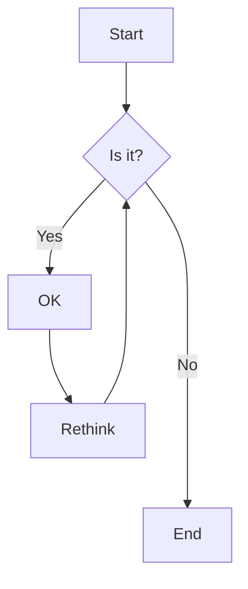
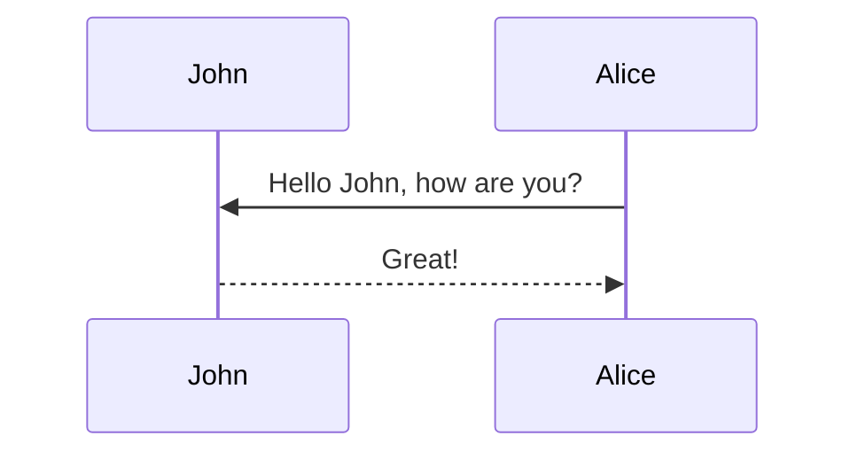
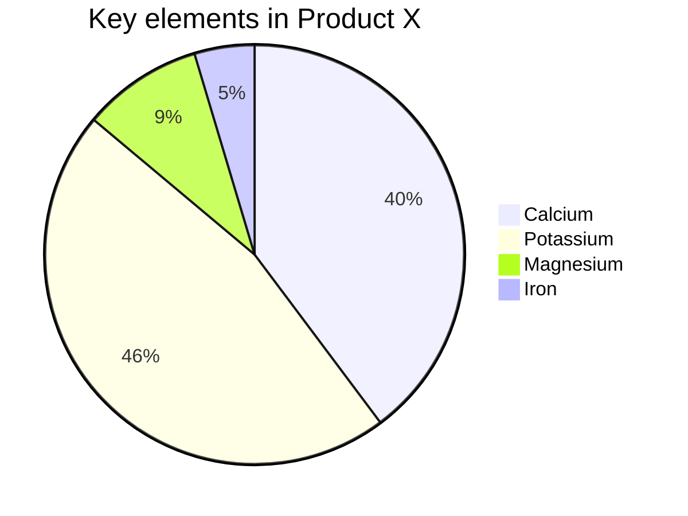
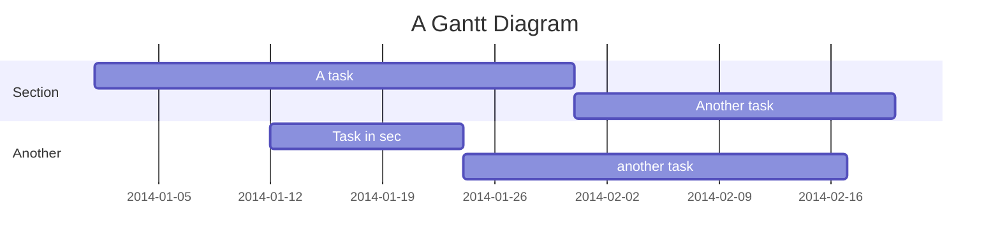
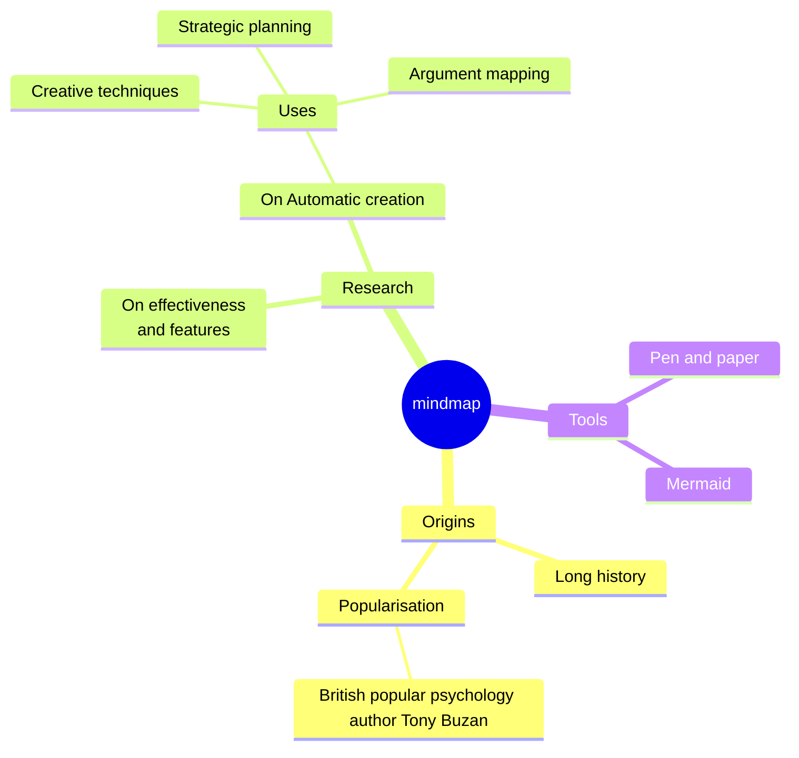

# 标题


[题目来源](https://fullstack-challenges.netlify.app/)

## 题目要求和代码
```vue

```

## 解答

```vue


- xx
+ aa
```

## 视频

[]()

https://vitepress.vuejs.org/guide/markdown#header-anchors


https://mermaid-js.github.io/mermaid/#/Setup

https://mermaid.js.org/syntax/flowchart.html









```
graph LR;
    K([])-.->G(());
    H([])-.->G
    G-->A;
    A()-->D();
classDef img fill:none,color:none,stroke:none,border-radius:50px
class G,D,A,K,H img
click G "http://www.github.com" "This is a link" _blank
click K "https://kustomize.io/" _blank
```


